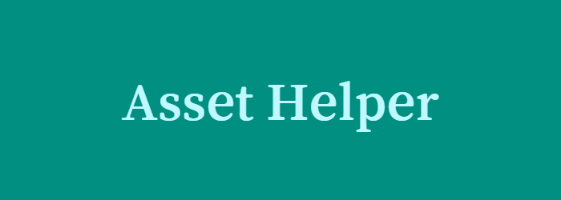

<h1 align="center">
  
  <br>
  Asset Helper
</h1>

<h4 align="center">
    A Telegram asset helper bot built with 
    <a href="https://fastapi.tiangolo.com/" target="_blank">FastAPI</a> + 
    <a href="https://docs.python-telegram-bot.org/" target="_blank">python-telegram-bot</a> +
    <a href="https://ffmpeg.org/" target="_blank">ffmpeg</a> +
    <a href="https://github.com/yt-dlp/yt-dlp" target="_blank">yt-dlp</a> +
    <a href="https://github.com/danielgatis/rembg" target="_blank">rembg</a>.
</h4>

<p align="center">
    <a href="#introduction">Intro</a> •
    <a href="#features">Features</a> •
    <a href="#setup">Setup</a> •
    <a href="#contact">Contact</a>
</p>

---

## Introduction

**Asset Helper** is a multifunctional Telegram bot that provides quick tools for working with media assets and creating videos.  
It can remove background from images, convert video files to mp3 and download audio and video files from youtube directly within Telegram.  

I built this project to practice using **FastAPI** and **python-telegram-bot**,  
focusing on integrating external tools and handling real-time file processing.  

---

## Features

- **Telegram Bot**: Easy-to-use bot that lets you work with assets directly in a Telegram chat.
- **Video → MP3**: Extract audio from videos using `ffmpeg`.
- **YouTube Downloader**: Download audio/video from YouTube links with `yt-dlp`.
- **Background Remover**: Remove image backgrounds using `rembg`.

---

## Setup

### 1. Clone the Repository

```bash
git clone https://github.com/NikolenkoRostislav/AssetHelper.git
cd AssetHelper
```

### 2. Environment variables

Create a `.env` file in the `tg-bot` folder with the following variables:
```env
API_KEY=Your telegram bot key
REMOVE_BG_URL=http://localhost:8001/bg-rm
YT_DOWNLOAD_URL=http://localhost:8002/yt-download
MP4_TO_MP3_URL=http://localhost:8003/mp4-to-mp3
```

### 3. Backend setup

Launch bg-remove-service, mp4-to-mp3-service and yt-download-service 

```bash
cd bg-remove-service
pip install -r requirements.txt
python main.py
```

```bash
cd mp4-to-mp3-service
pip install -r requirements.txt
python main.py
```

```bash
cd yt-download-service 
pip install -r requirements.txt
python main.py
```

### 4. Telegram bot setup

```bash
cd tg-bot
pip install -r requirements.txt
python main.py
```

### 5. Open in telegram

Start a chat with your Telegram bot and use the /help command to learn more about its features.

---

## Contact

You can contact me via:  
Work Email: rostislavnikolenkowork@gmail.com  
Personal Email: rostislav160307@gmail.com  
LinkedIn: [linkedin.com/in/rostyslav-nikolenko-58b069348](https://www.linkedin.com/in/rostyslav-nikolenko-58b069348)  
Telegram: @RSlavNV  
